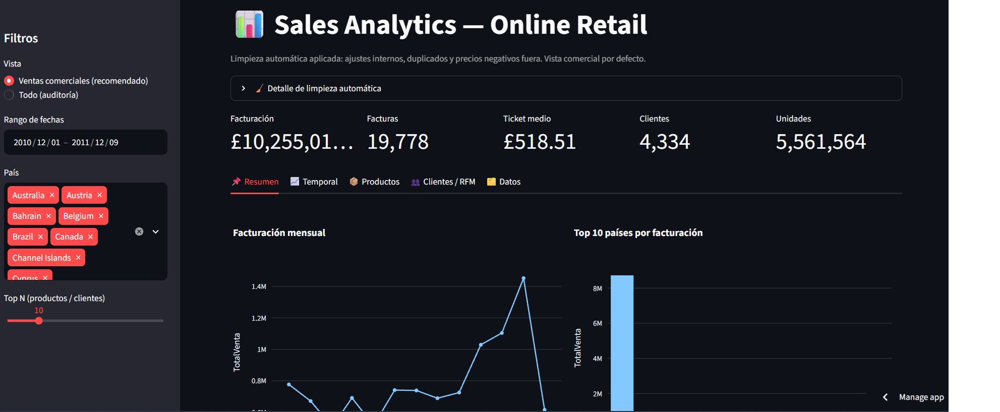
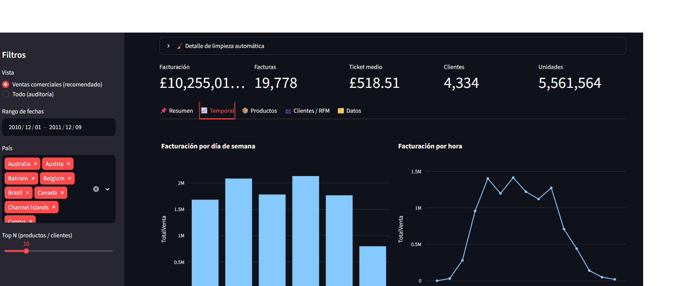
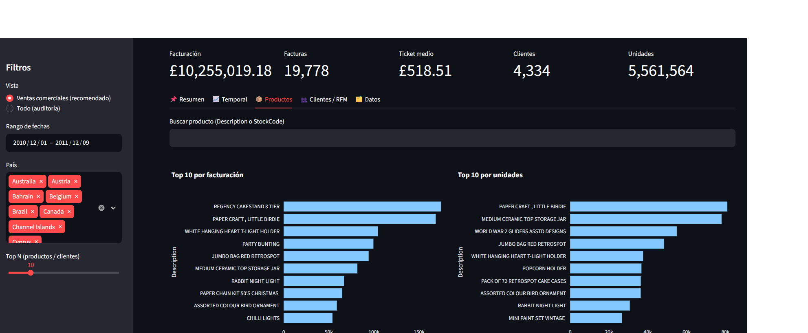
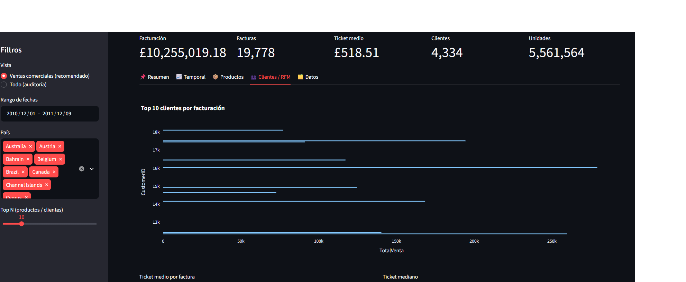
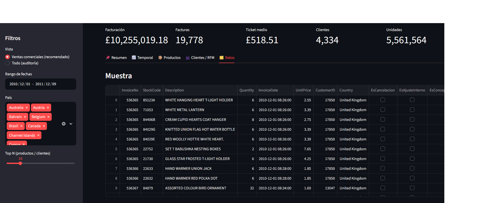

## Sales Analytics App


Interactive sales analytics application built with Python, Pandas and Streamlit to analyze sales performance, customer behavior, product performance and data quality through interactive dashboards and business-focused visualizations.

[](https://brian-sales-analytics-app.streamlit.app/)


 ## Project Overview

Sales Analytics App is an interactive data analytics project developed to transform raw transactional data into actionable business insights.

The application allows users to explore sales performance, temporal trends, product performance, customer segmentation and data quality through an interactive Streamlit dashboard.

The project combines data cleaning, exploratory data analysis, customer segmentation and interactive visualization in a single analytical application.


##  Live Demo

Explore the interactive application:

👉 [Open Sales Analytics App](https://brian-sales-analytics-app.streamlit.app/)


##  Application Sections

###  Sales Overview
Provides an overview of the main business KPIs, helping users understand overall sales performance.

###  Temporal Analysis
Explores sales trends over time to identify monthly patterns and changes in business performance.

###  Product Analysis
Identifies top-performing products by revenue and sales volume.

###  Customer Segmentation — RFM
Analyzes customer purchasing behavior using Recency, Frequency and Monetary value to identify different customer segments.

###  Data Quality & Audit
Provides information about data quality, cancelled transactions, excluded records and the distinction between commercial sales and audit records.


## Dataset

The project uses the Online Retail dataset, which contains transactional records from a UK-based online retail business.

The original dataset contains:

- 541,909 transactional records
- 8 original columns
- Invoice information
- Product information
- Transaction quantities
- Unit prices
- Customer identifiers
- Country information
- Transaction dates

The dataset was used as the foundation for the data cleaning, exploratory analysis, customer segmentation and business analysis performed in this project.


##  Data Cleaning & Preparation

The dataset was processed to improve data quality and prepare the information for reliable business analysis.

The cleaning and preparation process included:

- Duplicate detection and removal
- Identification of cancelled transactions
- Analysis of negative quantities
- Identification of non-product and adjustment records
- Treatment of missing customer information
- Validation of unit prices
- Creation of calculated sales fields
- Separation between commercial sales and audit records

After the cleaning and preparation process, the final dataset contained 535,303 records with no duplicated rows.

##  Analytical Methodology

The project follows a structured data analytics workflow:

1. **Data Loading**
   - Import of the original Online Retail dataset.

2. **Data Cleaning**
   - Detection and removal of duplicate records.
   - Identification of cancelled transactions.
   - Analysis of negative quantities and sales values.
   - Identification of non-product and adjustment records.
   - Treatment of missing values.

3. **Feature Engineering**
   - Calculation of total sales value.
   - Creation of cancellation and product classification fields.
   - Preparation of commercial sales data for analysis.

4. **Exploratory Data Analysis**
   - Sales trends over time.
   - Product performance.
   - Geographic analysis.
   - Customer purchasing behavior.

5. **Customer Segmentation**
   - RFM calculation.
   - Customer scoring from 1 to 5.
   - Business-oriented customer segmentation.

6. **Interactive Visualization**
   - Development of an interactive Streamlit dashboard.
   - KPI monitoring.
   - Filters and analytical views.
   - Data quality and audit section.

###  Data Quality Summary

| Metric | Result |
|---|---:|
| Original records | 541,909 |
| Final records | 535,303 |
| Duplicated rows after cleaning | 0 |
| Records with negative quantity | 9,251 |
| Records with zero sales value | 1,174 |
| Records with missing CustomerID | 133,699 |
| Active customers analyzed | 4,338 |


##  Customer Segmentation — RFM

Customer behavior was analyzed using RFM segmentation:

- **Recency:** How recently a customer made a purchase.
- **Frequency:** How frequently a customer made purchases.
- **Monetary:** How much a customer spent.

Each customer received RFM scores from 1 to 5 and was assigned to a business-oriented segment based on their purchasing behavior.

The analysis identified the following customer segments:

| Segment | Description |
|---|---|
| Champions | Highly engaged customers with strong purchasing behavior |
| Loyal | Customers with consistent purchasing activity |
| Recent | Customers with recent purchasing activity |
| Big Spenders | Customers with high monetary value |
| At Risk | Customers whose activity indicates potential disengagement |
| Lost Customers | Customers with significant inactivity |
| Needs Attention | Customers requiring further analysis and engagement |


##  Dashboard Preview

The application includes interactive dashboards for exploring sales
performance, temporal trends, product performance, customer segmentation
and data quality.

The screenshots below provide a visual overview of the application.


### Sales Overview



### Temporal Analysis



### Product Analysis



### Customer Segmentation — RFM



### Data Quality & Audit




##  Key Insights

The analysis revealed several relevant business patterns:

- **November 2011** was the highest-revenue month, with approximately **£1.46M** in sales.
- The **United Kingdom** represented the largest share of sales, with approximately **£8.19M** in revenue.
- **Thursday** generated the highest total revenue among the days analyzed.
- The customer analysis identified **4,338 active customers** for the RFM analysis.
- The **Champions** segment represented a high-value customer group, generating approximately **£5.81M** in revenue.
- Product analysis showed that sales performance differs depending on whether products are evaluated by **revenue or sales volume**.
- The data audit identified cancelled transactions, adjustment records and non-product concepts that required separate treatment from commercial sales.


##  Technologies

### Programming & Data Analysis

- Python
- Pandas
- NumPy

### Visualization & Application

- Streamlit
- Plotly
- Matplotlib

### Development & Deployment

- Jupyter Notebook
- Git
- GitHub
- Streamlit Community Cloud

### Data Processing

- OpenPyXL
- Parquet
- JSON


##  Project Structure

```text
Sales_Analytics_App/
│
├── app.py
├── 01_Data_Analysis.ipynb
├── requirements.txt
├── README.md
├── .gitignore
│
├── data/
│   └── Online Retail.xlsx
│
└── src/
    └── data.py

```
##  Run Locally

Follow these steps to run the application locally.

### 1. Clone the repository


## Run Locally

Follow these steps to run the application locally.

### 1. Clone the repository

```bash
git clone https://github.com/briian0148-ai/Sales_Analytics_App.git
cd Sales_Analytics_App
```

### 2. Create a virtual environment

```bash
python -m venv .venv
```

### 3. Activate the virtual environment

**Windows:**

```bash
.venv\Scripts\activate
```

**Linux / WSL / macOS:**

```bash
source .venv/bin/activate
```

### 4. Install dependencies

```bash
pip install -r requirements.txt
```

### 5. Run the Streamlit application

```bash
streamlit run app.py
```

The application will be available at:

```text
http://localhost:8501
```

##  Author

**Brayan Sanvicente**

Data Scientist Jr. / Data Analyst

This project is part of my Data Analytics portfolio and demonstrates the use
of Python to transform real-world transactional data into actionable insights
through data cleaning, exploratory analysis, customer segmentation and
interactive visualization.

🔗 **GitHub:** [briian0148-ai](https://github.com/briian0148-ai)


